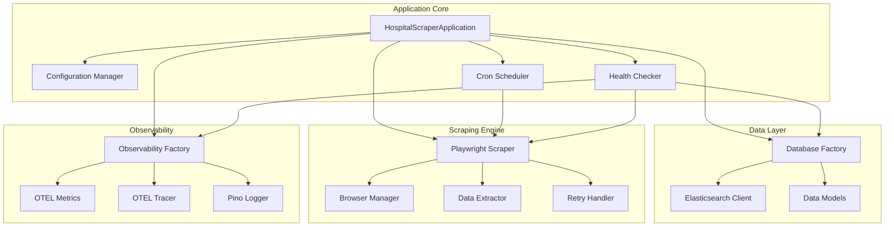
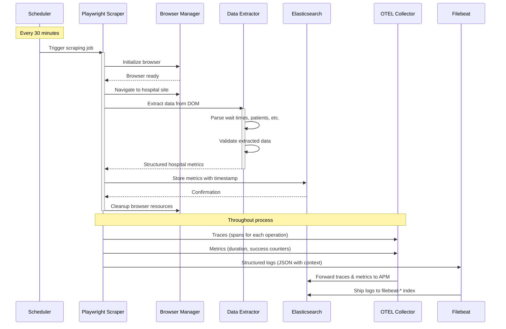
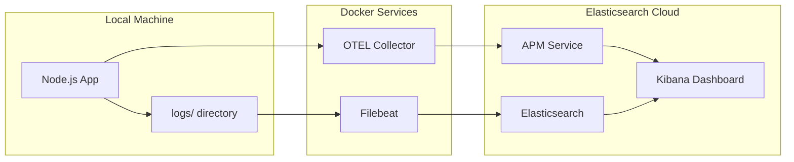
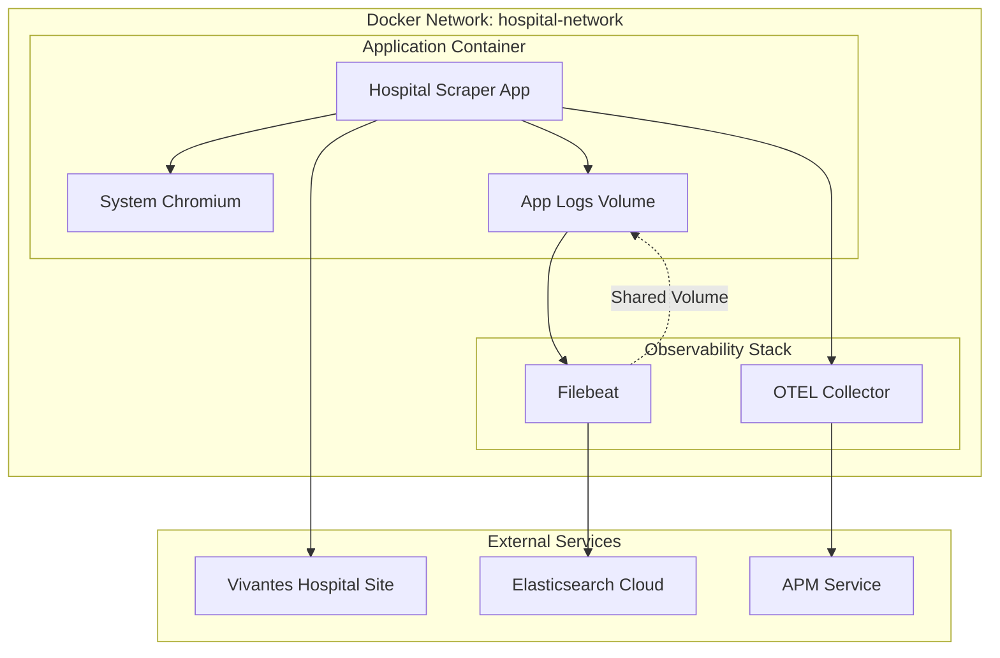
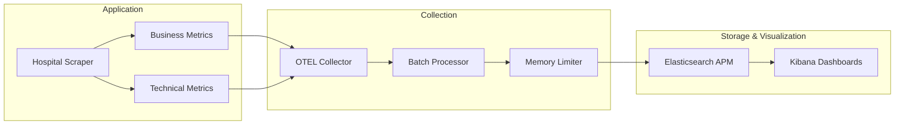

# 🏗️ Hospital Scraper - System Architecture

> **Comprehensive technical documentation for the Hospital Wait Time Monitoring System**

## 📋 Table of Contents

1. [System Overview](#-system-overview)
2. [Application Architecture](#-application-architecture)
3. [Data Flow](#-data-flow)
4. [Component Details](#-component-details)
5. [Deployment Architecture](#-deployment-architecture)
6. [Observability Stack](#-observability-stack)
7. [Database Schema](#-database-schema)
8. [Security & Configuration](#-security--configuration)
9. [Scalability & Performance](#-scalability--performance)
10. [Troubleshooting Guide](#-troubleshooting-guide)

---

## 🎯 System Overview

### Purpose
The Hospital Scraper is an automated monitoring system that tracks real-time emergency room wait times from [Vivantes Friedrichshain Hospital](https://www.vivantes.de/klinikum-im-friedrichshain/rettungsstelle). It provides comprehensive observability and stores data for analytics and trend analysis.

### Key Features
- **Automated Web Scraping**: Playwright-based browser automation for data extraction
- **Time-Series Storage**: Elasticsearch Cloud for metrics and historical data
- **Full Observability**: Logs, traces, and metrics via Elasticsearch APM
- **Production-Ready**: Docker containerization with health checks
- **Developer-Friendly**: Local development environment with hot reload

### Business Value
- **Patient Information**: Real-time wait time visibility for informed hospital visits
- **Trend Analysis**: Historical data for understanding emergency room patterns
- **System Monitoring**: Comprehensive observability for operational excellence

---

## 🏛️ Application Architecture



### Core Components

#### 1. **HospitalScraperApplication** (`src/index.ts`)
- **Purpose**: Main application orchestrator
- **Responsibilities**:
  - Environment validation and configuration loading
  - Component initialization in correct order
  - Graceful shutdown handling
  - Error handling and recovery
- **Initialization Sequence**:
  1. Environment validation
  2. Database initialization (early, before observability)
  3. Observability setup
  4. Scraper initialization
  5. Scheduler setup
  6. Health checker configuration
  7. Job scheduling
  8. Graceful shutdown handlers

#### 2. **Configuration Management** (`src/config/`)
- **Database Config**: Elasticsearch connection settings
- **Scraper Config**: Browser settings, retry policies, timeouts
- **Observability Config**: OTEL endpoints, sampling rates
- **Validation**: Zod schemas for type-safe configuration

#### 3. **Database Layer** (`src/database/`)
- **Factory Pattern**: Environment-based client creation
- **Elasticsearch Client**: Optimized for time-series data
- **Query Types**: Type-safe query builders
- **Error Handling**: Connection retry and failover logic

#### 4. **Scraping Engine** (`src/scraper/`)
- **Playwright Scraper**: Main scraping orchestrator
- **Browser Manager**: Chromium lifecycle management
- **Data Extractor**: DOM parsing and data validation
- **Retry Handler**: Exponential backoff for failed operations

#### 5. **Observability Stack** (`src/observability/`)
- **Factory Pattern**: Provider-agnostic observability
- **OTEL Integration**: Traces and metrics collection
- **Pino Logger**: Structured JSON logging
- **Elastic Integration**: Direct APM and log shipping

---

## 🔄 Data Flow



### Data Flow Details

1. **Trigger**: Cron scheduler fires every 30 minutes (configurable)
2. **Browser Launch**: Playwright launches system Chromium with security settings
3. **Navigation**: Browser navigates to hospital emergency room page
4. **DOM Parsing**: Data extractor identifies and parses wait time elements
5. **Data Validation**: Extracted data validated against schema
6. **Storage**: Metrics stored in Elasticsearch with timestamp and metadata
7. **Observability**: All operations traced and logged for monitoring
8. **Cleanup**: Browser resources properly disposed to prevent memory leaks

---

## 🧩 Component Details

### Scraping Engine Deep Dive

#### Browser Manager (`src/scraper/browser-manager.ts`)
```typescript
interface BrowserConfig {
  type: 'chromium' | 'firefox' | 'webkit';
  headless: boolean;
  timeout: number;
  userAgent?: string;
  viewport?: { width: number; height: number };
  proxy?: { server: string; username?: string; password?: string };
}
```

**Key Features**:
- **System Chromium**: Uses Alpine Linux system Chromium for smaller image
- **Security Hardening**: Disabled sandbox, dev-shm, acceleration for containers
- **Resource Management**: Proper cleanup of browser contexts and pages
- **Error Handling**: Comprehensive error tracking with observability

#### Data Extractor (`src/scraper/data-extractor.ts`)
**Extraction Logic**:
- **Wait Time**: Parses German text patterns for time indicators
- **Patient Counts**: Extracts numerical data from status tables
- **Data Freshness**: Calculates delay from last update timestamp
- **Validation**: Schema validation with detailed error reporting

#### Retry Handler (`src/scraper/retry-handler.ts`)
**Retry Strategy**:
- **Exponential Backoff**: 1s, 2s, 4s delays
- **Jitter**: Random delay to prevent thundering herd
- **Max Retries**: Configurable (default: 3)
- **Error Classification**: Differentiates retryable vs fatal errors

### Database Layer Deep Dive

#### Elasticsearch Client (`src/database/implementations/elasticsearch-client.ts`)
**Optimizations**:
- **Index Lifecycle Management**: Automatic rollover and retention
- **Time-Series Mappings**: Optimized for time-based queries
- **Connection Pooling**: Efficient connection management
- **Error Recovery**: Automatic reconnection with backoff

**Query Patterns**:
```typescript
interface HospitalMetricQuery {
  timeRange?: { start: Date; end: Date };
  aggregations?: {
    avgWaitTime?: boolean;
    patientTrends?: boolean;
    hourlyBreakdown?: boolean;
  };
  filters?: {
    minWaitTime?: number;
    maxPatients?: number;
  };
}
```

### Observability Deep Dive

#### OpenTelemetry Integration
**Traces**: 
- Span hierarchy for nested operations
- Automatic instrumentation for HTTP and database calls
- Custom spans for business logic
- Baggage propagation for context

**Metrics**:
- Business metrics (wait times, patient counts)
- Technical metrics (response times, error rates)
- Custom gauges and counters
- Histogram distributions

#### Pino Logger (`src/observability/otel/pino-logger.ts`)
**Features**:
- **ECS Compliance**: Elasticsearch Common Schema fields
- **Multi-destination**: Console + file output
- **Context Enrichment**: Request IDs, user context
- **Performance**: Asynchronous logging with minimal overhead

**Log Structure**:
```json
{
  "@timestamp": "2025-09-14T15:30:00.000Z",
  "level": "info",
  "log.level": "info",
  "message": "Scraping completed successfully",
  "service": {
    "name": "hospital-scraper",
    "version": "1.0.0"
  },
  "host": {
    "name": "container-id"
  },
  "process": {
    "pid": 7
  },
  "app_labels": {
    "environment": "production",
    "application": "hospital-scraper"
  },
  "scraping": {
    "duration_ms": 2341,
    "wait_time": 125,
    "total_patients": 48,
    "retry_count": 0
  }
}
```

---

## 🚀 Deployment Architecture

### Development Environment



**Development Setup** (`./dev-start.sh`):
- **Local App**: Run with `npm start` for hot reload
- **OTEL Collector**: Dockerized for trace/metric collection
- **Filebeat**: Dockerized for log shipping
- **File Monitoring**: Local logs directory mounted to Filebeat

### Production Environment



**Production Setup** (`./start.sh`):
- **Containerized App**: Built with multi-stage Docker
- **Service Dependencies**: Proper startup ordering with health checks
- **Shared Volumes**: Logs shared between app and Filebeat
- **Network Isolation**: Custom Docker network for service communication

### Docker Architecture

#### Multi-stage Dockerfile
```dockerfile
# Builder stage: Install all deps, build TypeScript
FROM node:20-alpine AS builder
RUN npm ci && npm run build

# Production stage: Runtime-only dependencies
FROM node:20-alpine AS production
# System Chromium + minimal dependencies
RUN apk add --no-cache chromium nss freetype harfbuzz
# Security: Non-root user
USER hospital-scraper
```

**Key Features**:
- **Alpine Linux**: Minimal base image (~5MB vs ~900MB for full Node)
- **System Chromium**: No need for Playwright browser downloads
- **Security**: Non-root user, disabled sandbox
- **Optimization**: Multi-stage build for smaller final image

#### Docker Compose Services

```yaml
services:
  otel-collector:
    image: otel/opentelemetry-collector-contrib:latest
    ports: ["4317:4317", "4318:4318", "8889:8889"]
    
  filebeat:
    image: docker.elastic.co/beats/filebeat:8.11.0
    volumes: ["/tmp/filebeat-runtime.yml:/usr/share/filebeat/filebeat.yml:ro"]
    
  hospital-scraper:
    build: { context: ., target: production }
    depends_on: [otel-collector, filebeat]
    healthcheck: ["CMD", "curl", "-f", "http://localhost:3000/health"]
```

---

## 📊 Observability Stack

### Metrics Architecture



### Key Metrics Collected

#### Business Metrics
- `hospital.wait_time`: Emergency room wait time in minutes
- `hospital.total_patients`: Current patient count
- `hospital.ambulance_patients`: Ambulance arrivals
- `hospital.emergency_cases`: Critical cases
- `hospital.update_delay`: Data freshness indicator

#### Technical Metrics
- `scraping.duration_seconds`: Scraping operation time
- `scraping.success_total`: Success counter
- `scraping.error_total`: Error counter with error type
- `database.operation_duration_seconds`: DB query performance
- `browser.launch_duration_seconds`: Browser startup time

#### System Metrics
- `app.heartbeat_total`: Application health indicator
- `app.memory_usage_bytes`: Memory consumption
- `app.cpu_usage_percent`: CPU utilization

### Distributed Tracing

**Trace Hierarchy**:
```
scraping_operation (30-60s)
├── browser_initialize (2-5s)
├── page_navigation (3-10s)
├── data_extraction (1-3s)
│   ├── wait_time_parsing (100-500ms)
│   ├── patient_count_parsing (100-500ms)
│   └── data_validation (50-200ms)
├── database_storage (200-1000ms)
└── browser_cleanup (500-2000ms)
```

**Span Attributes**:
- Business context (hospital_name, data_source)
- Technical context (browser_type, retry_attempt)
- Performance data (memory_usage, cpu_time)
- Error details (error_type, stack_trace)

### Log Management

#### Log Levels & Usage
- **DEBUG**: Detailed scraping steps, DOM elements found
- **INFO**: Successful operations, business events
- **WARN**: Retryable errors, performance degradation
- **ERROR**: Failed operations, system errors

#### Log Enrichment
- **Correlation IDs**: Track requests across components
- **User Context**: Session and user information
- **Performance Data**: Response times, memory usage
- **Business Context**: Hospital metrics, data quality

---

## 🗄️ Database Schema

### Hospital Metrics Index

**Index Pattern**: `hospital-metrics-YYYY.MM`
**Lifecycle**: 30 days hot, 90 days warm, 1 year cold, delete after 2 years

```json
{
  "mappings": {
    "properties": {
      "@timestamp": { "type": "date" },
      "hospital": {
        "type": "object",
        "properties": {
          "name": { "type": "keyword" },
          "department": { "type": "keyword" },
          "location": {
            "type": "object",
            "properties": {
              "city": { "type": "keyword" },
              "address": { "type": "text" }
            }
          }
        }
      },
      "metrics": {
        "type": "object",
        "properties": {
          "waitTime": { "type": "integer" },
          "totalPatients": { "type": "integer" },
          "ambulancePatients": { "type": "integer" },
          "emergencyCases": { "type": "integer" },
          "updateDelayMinutes": { "type": "integer" }
        }
      },
      "scraping": {
        "type": "object",
        "properties": {
          "timestamp": { "type": "date" },
          "duration_ms": { "type": "integer" },
          "success": { "type": "boolean" },
          "retry_count": { "type": "integer" },
          "browser_type": { "type": "keyword" }
        }
      },
      "data_quality": {
        "type": "object",
        "properties": {
          "completeness_score": { "type": "float" },
          "confidence_level": { "type": "keyword" },
          "anomaly_detected": { "type": "boolean" }
        }
      }
    }
  }
}
```

### Query Examples

#### Time-series Analysis
```typescript
// Get hourly average wait times for the last 7 days
const query = {
  query: {
    range: {
      '@timestamp': {
        gte: 'now-7d',
        lte: 'now'
      }
    }
  },
  aggs: {
    hourly_avg: {
      date_histogram: {
        field: '@timestamp',
        calendar_interval: '1h'
      },
      aggs: {
        avg_wait_time: {
          avg: {
            field: 'metrics.waitTime'
          }
        }
      }
    }
  }
};
```

#### Anomaly Detection
```typescript
// Find unusual spikes in patient count
const query = {
  query: {
    bool: {
      must: [
        { range: { '@timestamp': { gte: 'now-24h' } } },
        { range: { 'metrics.totalPatients': { gt: 80 } } }
      ]
    }
  },
  sort: [
    { '@timestamp': { order: 'desc' } }
  ]
};
```

---

## 🔒 Security & Configuration

### Environment Configuration

#### Required Variables
```bash
# Elasticsearch Cloud
ELASTICSEARCH_CLOUD_URL=https://your-deployment.es.region.gcp.cloud.es.io:9200
ELASTICSEARCH_API_KEY=base64_encoded_api_key
ELASTICSEARCH_APM_URL=https://your-deployment.apm.region.gcp.cloud.es.io:443

# Application
OTEL_SERVICE_NAME=hospital-scraper
OBSERVABILITY_PROVIDERS=elastic
NODE_ENV=production
```

#### Optional Configuration
```bash
# Scraping Settings
SCRAPING_INTERVAL=30                    # Minutes between scrapes
SCRAPING_TIMEZONE=Europe/Berlin         # Timezone for scheduling
BROWSER_TIMEOUT=30000                   # Browser timeout in ms
MAX_RETRIES=3                          # Max retry attempts

# Observability
LOG_LEVEL=info                         # debug|info|warn|error
OTEL_SERVICE_VERSION=1.0.0            # Service version for traces
```

### Security Measures

#### Container Security
- **Non-root User**: Application runs as `hospital-scraper` user (UID 1001)
- **Minimal Image**: Alpine Linux base with only required packages
- **No Privileged Mode**: Containers run without elevated privileges
- **Resource Limits**: Memory and CPU limits in production

#### Browser Security
- **Sandboxing Disabled**: Required for containerized environments
- **No GPU Access**: Disabled acceleration for security
- **User Agent Rotation**: Configurable user agents to avoid detection
- **Proxy Support**: Optional proxy configuration for network restrictions

#### API Security
- **API Key Authentication**: Elasticsearch Cloud API keys with minimal permissions
- **HTTPS Only**: All external communications over TLS
- **Rate Limiting**: Built-in retry mechanisms with exponential backoff
- **Input Validation**: Strict validation of all extracted data

#### Secrets Management
- **Environment Variables**: Sensitive data via environment variables only
- **No Hard-coded Secrets**: All credentials externalized
- **Base64 Encoding**: API keys properly encoded for transport
- **Rotation Ready**: Configuration supports key rotation without downtime

---

## ⚡ Scalability & Performance

### Performance Characteristics

#### Current Throughput
- **Scraping Frequency**: Every 30 minutes (48 operations/day)
- **Operation Duration**: 15-45 seconds per scrape
- **Data Volume**: ~2KB per metric record
- **Daily Data**: ~100KB structured data + logs

#### Scaling Considerations

**Horizontal Scaling**:
- **Multiple Hospitals**: Add hospital configs, scale scrapers
- **Geographic Distribution**: Deploy in multiple regions
- **Load Balancing**: Round-robin scraping across instances

**Vertical Scaling**:
- **Memory**: 512MB baseline, 1GB for high-frequency scraping
- **CPU**: Single core sufficient, dual core for sub-minute intervals
- **Storage**: 10GB annually for metrics + logs

#### Optimization Strategies

**Browser Optimization**:
```typescript
// Optimized browser configuration
const browserConfig = {
  headless: true,
  args: [
    '--no-sandbox',
    '--disable-setuid-sandbox',
    '--disable-dev-shm-usage',      // Reduce memory usage
    '--disable-accelerated-2d-canvas',
    '--no-first-run',
    '--no-zygote',
    '--disable-gpu'
  ]
};
```

**Database Optimization**:
- **Index Templates**: Pre-configured mappings for optimal storage
- **ILM Policies**: Automatic lifecycle management for cost optimization
- **Batch Writes**: Bulk API for high-volume scenarios
- **Query Optimization**: Appropriate date math and filters

**Memory Management**:
- **Browser Cleanup**: Proper disposal of browser contexts
- **Log Rotation**: Automatic log file rotation and cleanup
- **Garbage Collection**: Optimized Node.js GC settings

### Monitoring & Alerting

#### SLA Targets
- **Availability**: 99.5% uptime (scheduled maintenance excluded)
- **Scraping Success Rate**: 98% successful operations
- **Data Freshness**: Data never older than 45 minutes
- **Response Time**: Health check under 5 seconds

#### Alert Conditions
```yaml
alerts:
  scraping_failure:
    condition: error_rate > 10% over 15 minutes
    severity: warning
    
  high_wait_times:
    condition: avg_wait_time > 180 minutes over 30 minutes
    severity: info
    
  data_staleness:
    condition: last_successful_scrape > 60 minutes
    severity: critical
    
  resource_exhaustion:
    condition: memory_usage > 90% over 5 minutes
    severity: warning
```

---

## 🔧 Troubleshooting Guide

### Common Issues & Solutions

#### 1. Scraping Failures

**Symptoms**: Empty data, timeout errors, browser crashes
**Diagnosis**:
```bash
# Check browser logs
docker logs hospital-scraper-app | grep -i "browser\|playwright"

# Check network connectivity
curl -I https://www.vivantes.de/klinikum-im-friedrichshain/rettungsstelle

# Verify browser executable
docker exec hospital-scraper-app which chromium-browser
```

**Solutions**:
- **Website Changes**: Update selectors in data extractor
- **Network Issues**: Check proxy settings, DNS resolution
- **Browser Problems**: Restart container, check Chromium installation
- **Rate Limiting**: Increase intervals, implement random delays

#### 2. Database Connection Issues

**Symptoms**: Connection timeouts, authentication errors, index not found
**Diagnosis**:
```bash
# Test Elasticsearch connectivity
curl -H "Authorization: ApiKey $ELASTICSEARCH_API_KEY" \
     "$ELASTICSEARCH_CLOUD_URL/_cluster/health"

# Check index existence
curl -H "Authorization: ApiKey $ELASTICSEARCH_API_KEY" \
     "$ELASTICSEARCH_CLOUD_URL/hospital-metrics*/_count"
```

**Solutions**:
- **Authentication**: Verify API key format and permissions
- **Network**: Check firewall rules, VPN requirements
- **Index Issues**: Verify index templates and mapping
- **Resource Limits**: Check cluster capacity and quotas

#### 3. Observability Gaps

**Symptoms**: Missing traces, no logs in Kibana, metrics not appearing
**Diagnosis**:
```bash
# Check OTEL collector status
docker logs hospital-scraper-otel

# Verify Filebeat configuration
docker logs hospital-scraper-filebeat

# Test log file creation
ls -la logs/
tail -f logs/hospital-scraper.log
```

**Solutions**:
- **OTEL Issues**: Verify collector configuration and endpoints
- **Log Shipping**: Check Filebeat permissions and network
- **Config Problems**: Validate YAML syntax and environment variables
- **APM Setup**: Verify APM server URL and authentication

#### 4. Performance Issues

**Symptoms**: Slow scraping, high memory usage, timeout errors
**Diagnosis**:
```bash
# Monitor resource usage
docker stats hospital-scraper-app

# Check application performance
curl http://localhost:3000/health

# Analyze trace data in Kibana APM
```

**Solutions**:
- **Memory Leaks**: Restart services, check browser cleanup
- **CPU Bottlenecks**: Reduce scraping frequency, optimize selectors
- **Network Latency**: Increase timeouts, use closer regions
- **Database Performance**: Optimize queries, check index health

### Debug Commands

#### Development Debugging
```bash
# Start with debug logging
LOG_LEVEL=debug npm start

# Run single scraping operation
node -e "require('./dist/scraper').test()"

# Validate configuration
npm run type-check

# Check for linting issues
npm run lint
```

#### Production Debugging
```bash
# Access running container
docker exec -it hospital-scraper-app sh

# Check all service logs
docker-compose logs -f

# Restart specific service
docker-compose restart hospital-scraper

# Check service health
curl http://localhost:3000/health | jq
```

#### Elasticsearch Debugging
```bash
# Check cluster health
curl -H "Authorization: ApiKey $API_KEY" \
     "$ES_URL/_cluster/health?pretty"

# View recent indices
curl -H "Authorization: ApiKey $API_KEY" \
     "$ES_URL/_cat/indices/hospital-metrics*?v"

# Check for mapping conflicts
curl -H "Authorization: ApiKey $API_KEY" \
     "$ES_URL/hospital-metrics*/_mapping?pretty"
```

### Recovery Procedures

#### 1. Service Recovery
```bash
# Stop all services
./stop.sh

# Clean up resources
docker system prune -f

# Restart with fresh state
./start.sh
```

#### 2. Data Recovery
```bash
# Export existing data
curl -H "Authorization: ApiKey $API_KEY" \
     "$ES_URL/hospital-metrics*/_search?scroll=5m&size=1000" \
     > backup.json

# Re-index if needed
curl -X POST -H "Authorization: ApiKey $API_KEY" \
     "$ES_URL/_reindex" -d '{"source":{"index":"old_index"},"dest":{"index":"new_index"}}'
```

#### 3. Configuration Reset
```bash
# Reset to default configuration
git checkout main -- docker-compose.yml config/

# Regenerate runtime configs
./start.sh
```

---

## 📚 Additional Resources

### Documentation Links
- [Elasticsearch Guide](https://www.elastic.co/guide/en/elasticsearch/reference/current/)
- [OpenTelemetry Docs](https://opentelemetry.io/docs/)
- [Playwright Documentation](https://playwright.dev/docs/intro)
- [Docker Compose Reference](https://docs.docker.com/compose/)

### Monitoring Dashboards
- **Kibana APM**: Application performance monitoring
- **Kibana Discover**: Log analysis and search
- **Elasticsearch Monitoring**: Cluster health and performance

### Development Tools
- **TypeScript**: Static type checking
- **ESLint**: Code quality and consistency
- **Prettier**: Code formatting
- **Jest**: Unit and integration testing

---

*This architecture documentation is designed to provide comprehensive understanding of the Hospital Scraper system. For specific implementation details, refer to the source code and inline documentation.*
