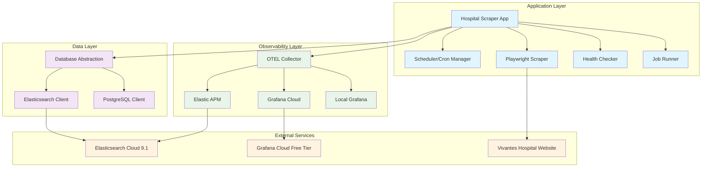
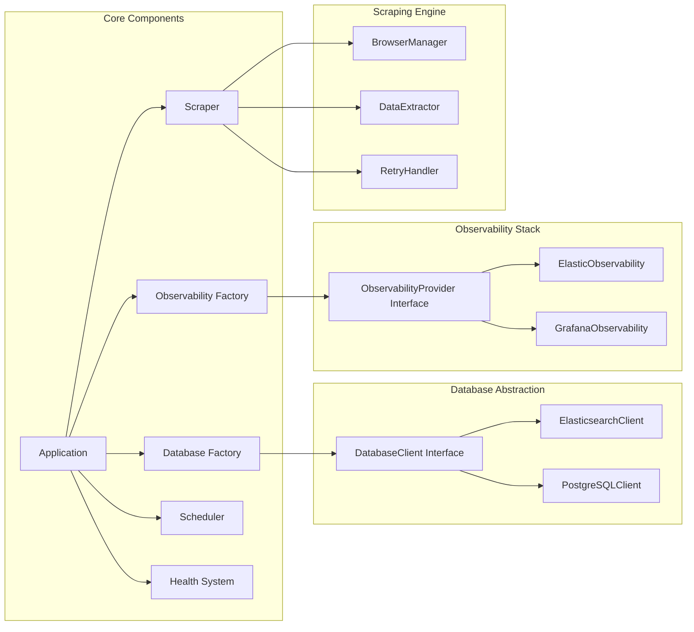
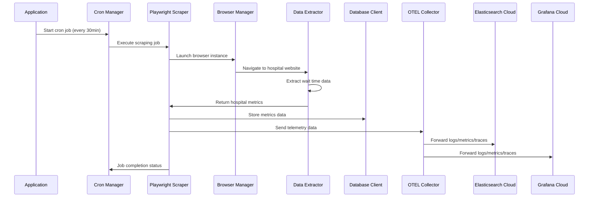

# TUG Klinikum - Hospital Wait Time Scraper & Analytics

[](https://www.typescriptlang.org/)
[](https://nodejs.org/)
[](https://docs.docker.com/compose/)
[](https://playwright.dev/)
[](https://www.elastic.co/)
[](https://opentelemetry.io/)

> **Production-Ready Hospital Data Scraping & Analytics System**  
> Automated scraping of wait times from Vivantes Friedrichshain Hospital with dual observability stack and time-series analytics.

## 🏥 Project Overview

**TUG Klinikum** is a sophisticated data collection and analytics system that monitors emergency room wait times and patient data from [Vivantes Friedrichshain Hospital](https://www.vivantes.de/klinikum-im-friedrichshain/rettungsstelle). The system runs automated scraping every 30 minutes, stores historical data in Elasticsearch Cloud, and provides comprehensive observability through both Elastic Stack and Grafana Cloud.

### Key Features

- 🕸️ **Robust Web Scraping**: Playwright-based multi-browser scraping with retry logic
- 🗄️ **Abstracted Database Layer**: Interface-based design supporting multiple database backends
- 📊 **Dual Observability Stack**: OpenTelemetry with Elastic APM + Grafana Cloud integration
- ⏰ **Intelligent Scheduling**: Timezone-aware cron jobs with graceful error handling
- 🚀 **Production Ready**: Docker-based deployment with health checks and monitoring
- 🔧 **Type-Safe**: Full TypeScript implementation with strict configuration
- 🛡️ **Secure & Compliant**: GDPR-compliant public data collection with respectful rate limiting

## 📋 Table of Contents

- [Architecture](#-architecture)
- [Technology Stack](#-technology-stack)
- [Project Structure](#-project-structure)
- [Getting Started](#-getting-started)
- [Configuration](#-configuration)
- [Deployment](#-deployment)
- [Monitoring & Observability](#-monitoring--observability)
- [Data Model](#-data-model)
- [API Endpoints](#-api-endpoints)
- [Development](#-development)
- [Troubleshooting](#-troubleshooting)

## 🏗️ Architecture

### System Architecture



### Component Architecture



### Data Flow



## 🛠️ Technology Stack

### Core Technologies

| Component | Technology | Version | Purpose |
|-----------|------------|---------|---------|
| **Runtime** | Node.js | 20+ | JavaScript runtime |
| **Language** | TypeScript | 5.3 | Type-safe development |
| **Web Scraping** | Playwright | 1.40 | Multi-browser automation |
| **Database** | Elasticsearch | 9.1 | Time-series data storage |
| **Scheduling** | node-cron | 3.0 | Automated job execution |
| **Observability** | OpenTelemetry | Latest | Unified telemetry |
| **Deployment** | Docker Compose | 3.8 | Containerized deployment |

### Observability Stack

#### Elastic Stack
- **Elasticsearch Cloud 9.1**: Managed database and APM storage
- **Kibana**: Data visualization and APM dashboard
- **Elastic APM**: Application performance monitoring

#### Grafana Stack (Free Tier)
- **Grafana Cloud**: Dashboard and alerting platform
- **Prometheus**: Metrics collection and storage (50GB/month)
- **Loki**: Log aggregation system (50GB/month)
- **Tempo**: Distributed tracing (50GB/month)

### Development Tools

- **ESLint + Prettier**: Code quality and formatting
- **Jest**: Unit testing framework
- **tsx**: Development server with hot reload
- **Zod**: Runtime type validation
- **UUID**: Unique identifier generation

## 📁 Project Structure

```
tug-klinikum/
├── 📁 src/                           # Source code
│   ├── 📁 config/                    # Configuration management
│   │   ├── database.ts               # Database configuration
│   │   ├── scraper.ts                # Scraper configuration
│   │   ├── observability.ts          # Observability configuration
│   │   └── index.ts                  # Configuration exports
│   ├── 📁 database/                  # Database abstraction layer
│   │   ├── 📁 interfaces/            # Database interfaces
│   │   │   ├── database-client.interface.ts
│   │   │   └── query-types.ts
│   │   ├── 📁 implementations/       # Database implementations
│   │   │   ├── elasticsearch-client.ts
│   │   │   └── postgresql-client.ts
│   │   ├── factory.ts                # Database factory pattern
│   │   └── index.ts
│   ├── 📁 observability/             # Observability system
│   │   ├── 📁 interfaces/            # Observability interfaces
│   │   ├── 📁 implementations/       # Provider implementations
│   │   ├── 📁 otel/                  # OpenTelemetry configuration
│   │   ├── factory.ts                # Observability factory
│   │   └── index.ts
│   ├── 📁 scraper/                   # Web scraping engine
│   │   ├── playwright-scraper.ts     # Main scraper class
│   │   ├── browser-manager.ts        # Browser lifecycle management
│   │   ├── data-extractor.ts         # Data extraction logic
│   │   ├── retry-handler.ts          # Retry and error handling
│   │   └── index.ts
│   ├── 📁 scheduler/                 # Job scheduling system
│   │   ├── cron-manager.ts           # Cron job management
│   │   ├── job-runner.ts             # Job execution logic
│   │   └── index.ts
│   ├── 📁 health/                    # Health monitoring
│   │   ├── health-check.ts           # Health check implementation
│   │   └── index.ts
│   ├── 📁 models/                    # Data models and schemas
│   │   └── hospital-metric.ts        # Hospital metric data model
│   ├── 📁 types/                     # TypeScript type definitions
│   │   └── dom.d.ts                  # DOM type declarations
│   ├── health-endpoint.ts            # HTTP health endpoint
│   └── index.ts                      # Application entry point
├── 📁 config/                        # Configuration files
│   └── otel-config.yaml              # OpenTelemetry Collector config
├── 📁 dist/                          # Compiled JavaScript output
├── 📄 docker-compose.yml             # Docker services definition
├── 📄 Dockerfile                     # Application container image
├── 📄 package.json                   # Node.js dependencies
├── 📄 tsconfig.json                  # TypeScript configuration
├── 📄 jest.config.js                 # Jest testing configuration
└── 📄 README.md                      # This file
```

## 🚀 Getting Started

### Prerequisites

- **Node.js** 20+ ([Download](https://nodejs.org/))
- **Docker** & **Docker Compose** ([Install](https://docs.docker.com/get-docker/))
- **Elasticsearch Cloud** account ([Sign up](https://cloud.elastic.co/))
- **Grafana Cloud** account ([Sign up](https://grafana.com/auth/sign-up/create-user))

### Quick Start

1. **Clone the repository**
```bash
   git clone <repository-url>
cd tug-klinikum
   ```

2. **Install dependencies**
   ```bash
npm install
```

3. **Set up environment variables** (see [Configuration](#-configuration))
   ```bash
   cp .env.example .env
   # Edit .env with your credentials
   ```

4. **Build the application**
   ```bash
   npm run build
   ```

5. **Start with Docker Compose**
   ```bash
   docker-compose up -d
   ```

6. **Verify deployment**
   ```bash
   curl http://localhost:3000/health
   ```

### Development Mode

```bash
# Start in development mode with hot reload
npm run dev

# Run tests
npm test

# Type checking
npm run type-check

# Linting and formatting
npm run lint
npm run format
```

## ⚙️ Configuration

### Environment Variables

Create a `.env` file in the project root:

```bash
# Database Configuration
DB_TYPE=elasticsearch
ELASTICSEARCH_CLOUD_URL=https://your-deployment.es.region.gcp.cloud.es.io:9243
ELASTICSEARCH_API_KEY=your_base64_encoded_api_key
ELASTICSEARCH_INDEX=hospital-metrics

# Grafana Cloud Configuration
GRAFANA_CLOUD_USER_ID=123456
GRAFANA_CLOUD_API_KEY=your_service_account_key
GRAFANA_CLOUD_PROMETHEUS_URL=https://prometheus-prod-01-region.grafana.net/api/prom/push
GRAFANA_CLOUD_LOKI_URL=https://logs-prod-region.grafana.net/loki/api/v1/push
GRAFANA_CLOUD_TEMPO_URL=https://tempo-region.grafana.net:443

# Application Configuration
NODE_ENV=production
PORT=3000
SCRAPING_INTERVAL=30
TIMEZONE=Europe/Berlin
LOG_LEVEL=info

# Scraper Configuration
TARGET_URL=https://www.vivantes.de/klinikum-im-friedrichshain/rettungsstelle
BROWSER_TYPE=chromium
HEADLESS=true
BROWSER_TIMEOUT=30000
MAX_RETRIES=3

# Observability Configuration
OBSERVABILITY_PROVIDERS=elastic,grafana
OTEL_SERVICE_NAME=hospital-scraper
OTEL_SERVICE_VERSION=1.0.0
OTEL_EXPORTER_OTLP_ENDPOINT=http://localhost:4317
```

### Service Setup

#### Elasticsearch Cloud Setup

1. Create account at https://cloud.elastic.co
2. Create a new deployment (Free tier available)
3. Get your deployment URL and create an API key
4. Add credentials to environment variables

#### Grafana Cloud Setup

1. Create account at https://grafana.com
2. Navigate to your stack settings
3. Create a service account with appropriate permissions
4. Get service URLs from "Send Data" section
5. Add credentials to environment variables

## 🐳 Deployment

### Docker Compose Deployment

The application includes a complete Docker Compose setup with:

- **hospital-scraper**: Main application container
- **otel-collector**: OpenTelemetry Collector for dual-stack observability
- **grafana-local**: Optional local Grafana instance for development

```bash
# Production deployment
docker-compose up -d

# Development with local Grafana
docker-compose --profile dev up -d

# View logs
docker-compose logs -f hospital-scraper

# Health check
docker-compose exec hospital-scraper curl http://localhost:3000/health
```

### Manual Deployment

```bash
# Build application
npm run build

# Start application
npm start

# Or with PM2 for process management
npm install -g pm2
pm2 start dist/index.js --name hospital-scraper
```

## 📊 Monitoring & Observability

### Built-in Health Endpoints

| Endpoint | Description | Response Format |
|----------|-------------|-----------------|
| `/health` | Comprehensive health check | JSON with component status |
| `/health/simple` | Simple OK/ERROR response | Plain text |
| `/health/ready` | Readiness probe | JSON |
| `/health/live` | Liveness probe | JSON |

Example health response:
```json
{
  "status": "healthy",
  "timestamp": "2024-01-15T10:30:00.000Z",
  "uptime": "2h 15m 30s",
  "components": {
    "database": {
      "status": "healthy",
      "responseTime": "45ms",
      "version": "8.11.0"
    },
    "scraper": {
      "status": "healthy",
      "lastRun": "2024-01-15T10:28:00.000Z",
      "nextRun": "2024-01-15T11:00:00.000Z"
    }
  }
}
```

### Observability Features

#### Elastic Stack
- **Application Performance Monitoring**: Full APM integration
- **Log Management**: Structured logging with correlation IDs
- **Error Tracking**: Automatic error capture and analysis
- **Infrastructure Monitoring**: Resource usage and performance metrics

#### Grafana Stack
- **Metrics Dashboard**: Custom metrics for scraping performance
- **Log Aggregation**: Centralized log collection and search
- **Distributed Tracing**: Full request tracing across components
- **Alerting**: Configurable alerts for failures and performance issues

#### Custom Metrics

The application tracks:
- Scraping success/failure rates
- Response times and performance metrics
- Database connection health
- Job execution statistics
- Error rates and types

## 📊 Data Model

### Hospital Metric Schema

```typescript
interface HospitalMetric {
  id: string;                    // UUID
  timestamp: Date;               // Data collection time
  waitTimeMinutes: number;       // Current wait time
  totalPatients?: number;        // Total patients waiting
  ambulancePatients?: number;    // Ambulance arrivals
  emergencyCases?: number;       // Emergency cases
  updateDelayMinutes?: number;   // Data freshness indicator
  scrapingSuccess: boolean;      // Scraping success flag
  sourceUrl: string;             // Source website URL
  metadata: {
    scraperId: string;           // Scraper instance ID
    version: string;             // Application version
    processingTimeMs: number;    // Scraping duration
    browserType?: string;        // Browser used
    userAgent?: string;          // User agent string
    screenResolution?: string;   // Browser resolution
    errorMessage?: string;       // Error details if failed
  };
}
```

### Data Storage

**Elasticsearch Index Structure:**
- **Index Pattern**: `hospital-metrics-YYYY.MM`
- **Mapping**: Optimized for time-series queries
- **Retention**: Configurable (default: 1 year)
- **Rollover**: Monthly index rotation

### Web Scraping Configuration

**Target Website**: [Vivantes Friedrichshain Emergency Room](https://www.vivantes.de/klinikum-im-friedrichshain/rettungsstelle)

**Key Selectors** (Updated September 2025):
```typescript
// Wait Time Data
'.wazimo__waittime .fact'        // "56 min"

// Patient Counts  
'.wazimo__waiting .fact'         // "33 Patient*innen sind in Behandlung"
'.wazimo__ambulance .fact'       // "13 Patient*innen kamen mit Rettungswagen"

// Last Updated
'.wazimo__age'                   // "zuletzt aktualisiert vor 14 min"
```

**Data Extraction Logic**:
- **German Language Support**: Keywords include `behandlung`, `warten`, `rettungswagen`
- **Pattern Matching**: `/zuletzt\s*aktualisiert\s*vor\s*(\d+)\s*min/i`
- **Fallback Selectors**: Generic selectors for robustness

> **Note**: Selectors are specific to Vivantes website structure. If scraping fails, check for website layout changes and update selectors accordingly.

## 🔌 API Endpoints

### Health Endpoints

- `GET /health` - Comprehensive health status
- `GET /health/simple` - Simple health check
- `GET /health/ready` - Kubernetes readiness probe
- `GET /health/live` - Kubernetes liveness probe

### Future API Endpoints (Planned)

- `GET /api/metrics/latest` - Latest hospital metrics
- `GET /api/metrics/history` - Historical data with filters
- `GET /api/metrics/trends` - Trend analysis
- `GET /api/metrics/summary` - Statistical summary

## 🔧 Development

### Code Quality

The project enforces strict code quality standards:

```bash
# Type checking
npm run type-check

# Linting
npm run lint
npm run lint:fix

# Code formatting
npm run format

# Testing
npm test
npm run test:watch
```

### Architecture Principles

#### Database Abstraction
```typescript
// Easy database switching
const db = DatabaseFactory.create(process.env.DB_TYPE);
await db.connect();
await db.insert(hospitalData);

// Future migration example:
// Change DB_TYPE=elasticsearch to DB_TYPE=postgresql
// Zero code changes needed
```

#### Observability Factory Pattern
```typescript
// Single instrumentation, dual destinations
const obs = ObservabilityFactory.create(['elastic', 'grafana-cloud']);
obs.logger.info('Scraping started', { correlationId });
obs.metrics.counter('scrapes.total').inc();
obs.tracer.startSpan('scrape.execution');
```

### Key Design Decisions

1. **Interface-Based Architecture**: Enables easy component replacement
2. **Factory Pattern**: Centralized creation and configuration
3. **OpenTelemetry Integration**: Vendor-neutral observability
4. **Dual Observability Stack**: Learn both Elastic and Grafana ecosystems
5. **TypeScript Strict Mode**: Maximum type safety
6. **Comprehensive Error Handling**: Graceful degradation and recovery

## 🚨 Troubleshooting

### Common Issues

#### OpenTelemetry Instrumentation Conflicts

**Problem**: Elasticsearch client receiving 400 errors despite correct credentials.

**Cause**: OpenTelemetry auto-instrumentation intercepting HTTP requests.

**Solution**: Database initialization before observability setup:
```typescript
// Initialize database BEFORE observability
await this.initializeDatabaseEarly();
await this.initializeObservability();
```

#### Playwright Browser Issues

**Problem**: Browser launch failures in Docker.

**Solutions**:
```bash
# Install browser dependencies
npx playwright install-deps

# Use specific browser
BROWSER_TYPE=chromium

# Increase timeout
BROWSER_TIMEOUT=60000
```

#### Elasticsearch Connection Issues

**Problem**: Connection timeouts or authentication errors.

**Debugging**:
```bash
# Test connectivity
curl -X GET "https://your-deployment.es.region.gcp.cloud.es.io:9243/" \
  -H "Authorization: ApiKey YOUR_API_KEY"

# Check logs
docker-compose logs hospital-scraper | grep -i elasticsearch
```

### Debugging Commands

```bash
# Application logs
docker-compose logs -f hospital-scraper

# OTEL Collector logs
docker-compose logs -f otel-collector

# Database connection test
npm run test -- --testNamePattern="database"

# Scraper test
npm run test -- --testNamePattern="scraper"
```

### Performance Tuning

#### Memory Optimization
```yaml
# docker-compose.yml memory limits
deploy:
  resources:
    limits:
      memory: 512M
    reservations:
      memory: 256M
```

#### Scraping Optimization
```typescript
// Reduce browser resource usage
const browserConfig = {
  args: [
    '--no-sandbox',
    '--disable-dev-shm-usage',
    '--disable-gpu',
    '--no-first-run',
    '--disable-default-apps'
  ]
};
```

## 📜 License

This project is licensed under the MIT License - see the [LICENSE](LICENSE) file for details.

## 🤝 Contributing

1. Fork the repository
2. Create a feature branch (`git checkout -b feature/amazing-feature`)
3. Commit your changes (`git commit -m 'Add amazing feature'`)
4. Push to the branch (`git push origin feature/amazing-feature`)
5. Open a Pull Request

## 📞 Support

For support and questions:

1. Check the [Troubleshooting](#-troubleshooting) section
2. Review [GitHub Issues](../../issues)
3. Create a new issue with detailed information

---

**Built with ❤️ for better healthcare accessibility**

*This project demonstrates modern TypeScript application architecture with production-ready observability, scalable data storage, and robust error handling.*