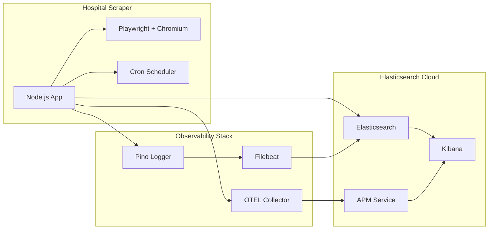

# 🏥 Hospital Scraper

> **Real-time hospital wait time monitoring with comprehensive observability**

Automated scraping of emergency room data from [Vivantes Friedrichshain Hospital](https://www.vivantes.de/klinikum-im-friedrichshain/rettungsstelle) with storage in Elasticsearch Cloud and full observability stack.

## 🚀 Quick Start

### Local Development
```bash
# 1. Setup environment
cp env.example .env
# Edit .env with your Elasticsearch Cloud credentials

# 2. Install dependencies  
npm install

# 3. Start observability services
./dev-start.sh

# 4. Start application (in another terminal)
npm run dev
```

### Production Deployment
```bash
# 1. Configure environment
cp env.example .env
# Edit .env with production settings

# 2. Deploy complete containerized stack
./start.sh

# 3. Monitor deployment
docker-compose logs -f

# 4. Stop when needed
./stop.sh
```

## 🏗️ Architecture

> 📖 **For detailed technical documentation, see [Architecture.md](./Architecture.md)**



**Core Components:**
- **🎭 Playwright Scraper**: Automated browser-based data extraction
- **📊 Elasticsearch Cloud**: Time-series data storage and search
- **🔍 OpenTelemetry**: Distributed tracing and metrics collection
- **📝 Pino + Filebeat**: Structured logging pipeline
- **⏰ Cron Scheduler**: Automated scraping every 30 minutes

## 📊 Data Captured

| Field | Description | Example |
|-------|-------------|---------|
| `waitTime` | Emergency room wait time in minutes | `125` |
| `totalPatients` | Patients in treatment or waiting | `48` |
| `ambulancePatients` | Patients arrived by ambulance | `21` |
| `emergencyCases` | Life-threatening emergencies | `4` |
| `updateDelayMinutes` | Data freshness indicator | `11` |

## ⚙️ Configuration

### Required Environment Variables
```bash
# Elasticsearch Cloud (Required)
ELASTICSEARCH_CLOUD_URL=https://your-deployment.es.region.gcp.cloud.es.io:9200
ELASTICSEARCH_API_KEY=your_base64_encoded_api_key
ELASTICSEARCH_APM_URL=https://your-deployment.apm.region.gcp.cloud.es.io:443

# Application Settings (Optional)
OTEL_SERVICE_NAME=hospital-scraper
SCRAPING_INTERVAL=30
LOG_LEVEL=info
NODE_ENV=production
```

> 🔧 **Complete configuration reference**: Copy `env.example` to `.env` and customize as needed.

## 📈 Observability

All telemetry data flows to **Elasticsearch Cloud** for unified monitoring:

### 🔍 **APM (Application Performance Monitoring)**
- **Service**: `hospital-scraper`
- **Traces**: End-to-end request flows with timing
- **Metrics**: Performance counters and business KPIs
- **Dashboard**: Available in Kibana APM

### 📝 **Structured Logs**
- **Index Pattern**: `filebeat-*`
- **Format**: JSON with ECS (Elastic Common Schema) compliance
- **Real-time**: Shipped via Filebeat with automatic parsing

### 🎯 **Key Metrics Tracked**
| Metric | Description | Type |
|--------|-------------|------|
| `scraping_duration_seconds` | Time per scraping operation | Histogram |
| `scraping_success_total` | Successful operations count | Counter |
| `hospital.wait_time` | Current emergency wait time | Gauge |
| `app_heartbeat_total` | Application health indicator | Counter |

### 🚨 **Health Monitoring**
```bash
# Application health check
curl http://localhost:3000/health

# Service status
docker-compose ps

# Live logs
docker-compose logs -f hospital-scraper
```

## 🐳 Deployment Options

### 🛠️ **Development Mode**
Run the app locally with containerized observability services:
```bash
./dev-start.sh     # Start OTEL + Filebeat containers
npm run dev        # Run app with hot reload
./dev-stop.sh      # Stop observability services
```

### 🚀 **Production Mode**
Complete containerized deployment:
```bash
./start.sh         # Deploy full stack
docker-compose ps  # Check service status
./stop.sh          # Stop all services
```

## 🔍 Operations & Monitoring

### 📊 **Service Management**
```bash
# Check all services
docker-compose ps

# View aggregated logs  
docker-compose logs -f

# Restart specific service
docker-compose restart hospital-scraper

# Scale services (if needed)
docker-compose up -d --scale hospital-scraper=2
```

### 🩺 **Health Checks**
```bash
# Application health endpoint
curl -s http://localhost:3000/health | jq

# Individual service logs
docker-compose logs hospital-scraper
docker-compose logs otel-collector
docker-compose logs filebeat

# Resource usage
docker stats --no-stream
```

### 📱 **Kibana Dashboards**
Access your Elasticsearch Cloud Kibana instance:
- **APM**: Monitor application performance and traces
- **Discover**: Search and analyze logs (`filebeat-*` index)
- **Metrics**: Custom dashboards for hospital wait time trends

## 🛠️ Development

### 🔨 **Build & Test**
```bash
# TypeScript compilation
npm run build

# Run tests
npm test
npm run test:watch

# Code quality
npm run lint
npm run lint:fix
npm run format

# Type checking
npm run type-check
```

### 📁 **Project Structure**
```
src/
├── config/           # Environment & configuration management
├── database/         # Elasticsearch client implementations
├── scraper/          # Playwright-based web scraping engine
│   ├── browser-manager.ts    # Chromium lifecycle management
│   ├── data-extractor.ts     # DOM parsing & validation
│   └── playwright-scraper.ts # Main scraping orchestrator
├── scheduler/        # Cron job management & execution
├── observability/    # OpenTelemetry + Pino logging stack
│   ├── otel/         # OTEL tracers, metrics, loggers
│   └── implementations/      # Elastic observability provider
├── health/           # Health check endpoints & monitoring
└── models/           # TypeScript data models & validation
```

### 🔧 **Tech Stack**
| Component | Technology | Version | Purpose |
|-----------|------------|---------|---------|
| **Runtime** | Node.js + TypeScript | 20+ / 5.x | Application platform |
| **Web Scraping** | Playwright + Chromium | 1.40+ | Browser automation |
| **Database** | Elasticsearch Cloud | 8.11+ | Time-series storage |
| **Scheduling** | node-cron | 3.0+ | Automated job execution |
| **Observability** | OpenTelemetry + Pino | Latest | Comprehensive monitoring |
| **Containerization** | Docker + Docker Compose | Latest | Production deployment |

### 🚀 **Scripts Reference**
| Script | Purpose | Environment |
|--------|---------|-------------|
| `./dev-start.sh` | Start observability services | Development |
| `./dev-stop.sh` | Stop development services | Development |
| `./start.sh` | Full containerized deployment | Production |
| `./stop.sh` | Stop all services & cleanup | Production |
| `npm run dev` | Hot reload development | Development |
| `npm start` | Production build execution | Production |

---

## 📚 Documentation

- **[📖 Architecture.md](./Architecture.md)**: Comprehensive technical documentation
- **[⚙️ env.example](./env.example)**: Complete configuration reference
- **[🐳 docker-compose.yml](./docker-compose.yml)**: Production deployment configuration

## 🤝 Contributing

1. Fork the repository
2. Create a feature branch: `git checkout -b feature/amazing-feature`
3. Commit changes: `git commit -m 'Add amazing feature'`
4. Push to branch: `git push origin feature/amazing-feature`
5. Open a Pull Request

## 📝 License

This project is licensed under a **Custom Attribution-NonCommercial License**.

### ✅ **Allowed (Non-Commercial Use):**
- Personal projects and learning
- Academic research and education
- Open source projects
- Non-profit organizations
- Community contributions

### ❌ **Requires Permission (Commercial Use):**
- Commercial products or services
- Revenue-generating applications
- Proprietary commercial solutions
- Selling or licensing the software

### 📋 **Requirements:**
- **Attribution**: Must credit Achyut Jhunjhunwala and link to original repository
- **Commercial Permission**: Contact author for commercial use rights

**For commercial licensing, please reach out through GitHub issues or repository discussions.**

See the full [LICENSE](./LICENSE) file for complete terms and conditions.

---

**🏥 Helping patients make informed decisions through real-time emergency room monitoring.**

> *Built with ❤️ for better healthcare accessibility*