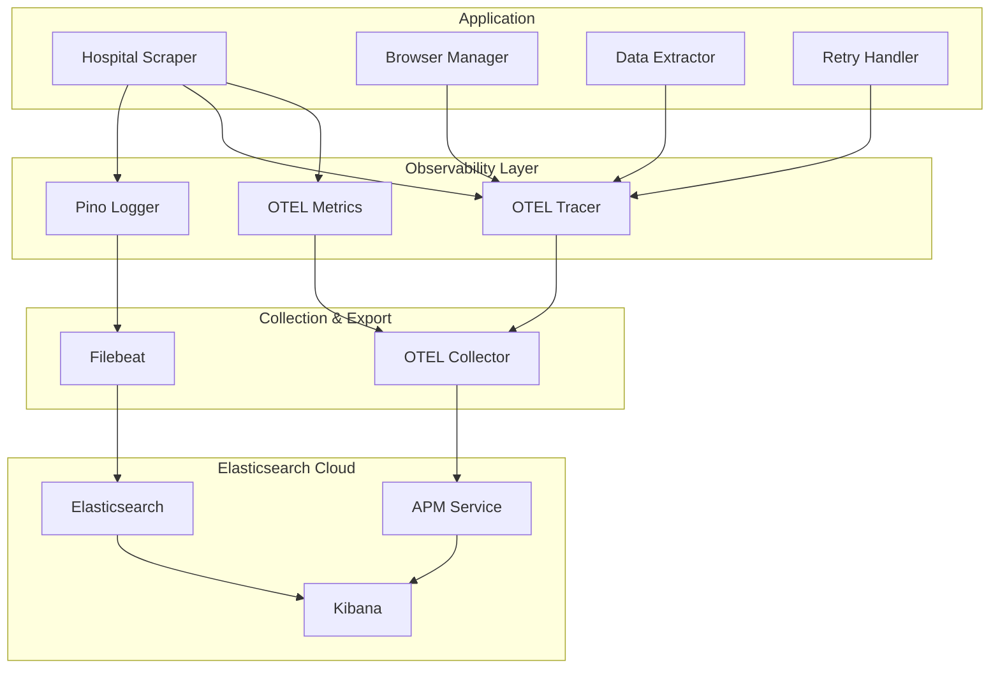

# 🔍 Hospital Scraper - Observability Guide

> **Comprehensive observability implementation for production monitoring and learning OpenTelemetry**

## 📋 Table of Contents

1. [Overview](#-overview)
2. [Architecture](#-architecture)
3. [Key Components](#-key-components)
4. [Business Metrics](#-business-metrics)
5. [Technical Metrics](#-technical-metrics)
6. [Distributed Tracing](#-distributed-tracing)
7. [Logging Strategy](#-logging-strategy)
8. [Production vs Development](#-production-vs-development)
9. [Monitoring & Alerting](#-monitoring--alerting)
10. [Troubleshooting](#-troubleshooting)
11. [OpenTelemetry Learning Guide](#-opentelemetry-learning-guide)

---

## 🎯 Overview

This application implements **production-grade observability** using OpenTelemetry (OTEL), designed for both operational excellence and learning. The observability stack captures **three pillars**: metrics, traces, and logs, all flowing to **Elasticsearch Cloud** for unified monitoring.

### Key Principles

- **Production-First**: Log levels and metrics designed for real-world operations
- **Business-Focused**: Capture what matters for hospital wait time monitoring
- **Performance-Aware**: Minimal overhead, intelligent sampling
- **Learning-Oriented**: Clear examples of OpenTelemetry best practices

---

## 🏗️ Architecture



### Data Flow

1. **Application Events** → Observability Layer
2. **Structured Logs** → Filebeat → Elasticsearch
3. **Traces & Metrics** → OTEL Collector → Elasticsearch APM
4. **Unified View** → Kibana Dashboards

---

## 🧩 Key Components

### 1. **ObservabilityFactory** (`src/observability/factory.ts`)
- **Purpose**: Simplified factory for Elastic-only setup
- **Environment-Based Configuration**: Auto-detects log levels by environment
- **Validation**: Comprehensive config validation

```typescript
// Production: WARN level (errors + important events only)
// Staging: INFO level (business events)
// Development: DEBUG level (detailed operation logs)
const provider = ObservabilityFactory.createFromEnv();
```

### 2. **Enhanced OTEL Tracer** (`src/observability/otel/tracer.ts`)
- **Professional Exception Handling**: Proper `span.addException()` usage
- **Business Context**: Specialized methods for business data
- **Retry-Aware**: Built-in retry operation tracing

### 3. **Production-Focused Logger** (`src/observability/otel/pino-logger.ts`)
- **Environment-Aware**: Different verbosity per environment
- **Error Categorization**: Automatic error classification
- **ECS Compliance**: Elasticsearch Common Schema format

### 4. **Comprehensive Metrics** (`src/observability/otel/metrics.ts`)
- **Business Metrics**: Hospital wait times, patient counts
- **Technical Metrics**: Performance, errors, system health
- **Production Histograms**: Meaningful time boundaries

---

## 📊 Business Metrics

### Core Hospital Data

| Metric | Type | Description | Example Value |
|--------|------|-------------|---------------|
| `hospital_wait_time_minutes` | Gauge | Current ER wait time | `125` |
| `hospital_patient_count` | Gauge | Total patients in ER | `48` |
| `data_freshness_minutes` | Gauge | Age of scraped data | `11` |
| `data_quality_score` | Gauge | Data completeness (0-1) | `0.9` |

### Data Quality Indicators

```typescript
// Recorded automatically during scraping
metrics.recordHospitalData(
  waitTime: 125,      // Wait time in minutes
  patientCount: 48,   // Current patients
  dataAge: 11,        // Data freshness
  qualityScore: 0.9   // Completeness score
);
```

### Business Value

- **Patient Experience**: Track wait time trends
- **Hospital Capacity**: Monitor patient volume patterns
- **Data Reliability**: Ensure scraping quality

---

## ⚙️ Technical Metrics

### Scraping Performance

| Metric | Type | Description | Use Case |
|--------|------|-------------|----------|
| `scraping_duration_seconds` | Histogram | End-to-end scraping time | Performance monitoring |
| `scraping_success_total` | Counter | Successful scraping operations | Success rate tracking |
| `scraping_failures_total` | Counter | Failed operations by error type | Error pattern analysis |
| `scraping_retry_count` | Histogram | Retries per operation | Reliability assessment |

### Browser Performance

| Metric | Type | Description | Use Case |
|--------|------|-------------|----------|
| `browser_launch_duration_seconds` | Histogram | Browser startup time | Performance optimization |
| `browser_navigation_duration_seconds` | Histogram | Page load time | Network monitoring |
| `browser_crashes_total` | Counter | Browser crashes by reason | Stability tracking |

### Database Operations

| Metric | Type | Description | Use Case |
|--------|------|-------------|----------|
| `db_operation_duration_seconds` | Histogram | Database response times | Performance monitoring |
| `db_connection_healthy` | Gauge | Connection health (1/0) | Health monitoring |
| `records_inserted_total` | Counter | Successful data insertions | Data flow tracking |

### System Health

| Metric | Type | Description | Use Case |
|--------|------|-------------|----------|
| `application_uptime_seconds` | Gauge | Application runtime | Availability tracking |
| `memory_usage_bytes` | Gauge | Memory consumption by type | Resource monitoring |
| `app_heartbeat_total` | Counter | Pipeline connectivity check | End-to-end verification |

---

## 🔗 Distributed Tracing

### Trace Hierarchy

```
scraping_operation (30-60s)
├── browser_initialize (2-5s)
├── page_navigation (3-10s)
├── data_extraction (5-15s)
│   ├── page_ready_wait (1-5s)
│   ├── scrape_page_data (2-8s)
│   └── parse_scraped_data (1-3s)
├── retry_hospital_scraping (if needed)
│   ├── hospital_scraping_attempt_1
│   ├── hospital_scraping_attempt_2
│   └── hospital_scraping_attempt_3
└── database_operation (200ms-1s)
```

### Span Attributes

#### Business Context
```typescript
span.setAttributes({
  'business.wait_time_minutes': 125,
  'business.patient_count': 48,
  'business.data_quality_score': 0.9,
});
```

#### Technical Context
```typescript
span.setAttributes({
  'scraper.correlation_id': 'uuid',
  'scraper.target_url': 'hospital-url',
  'scraper.browser_type': 'chromium',
  'scraper.retries': 2,
});
```

#### Error Context
```typescript
// Automatically added by enhanced tracer
span.setAttributes({
  'error.type': 'TimeoutError',
  'error.message': 'Navigation timeout',
  'error.category': 'timeout',
  'retry.attempt': 3,
});
```

### Custom Span Creation

```typescript
// Create business-focused spans
const span = tracer.createScrapingSpan(
  'extract_patient_data',
  'https://hospital.com',
  correlationId
);

// Add business context
tracer.addBusinessContext(span, {
  waitTime: 125,
  patientCount: 48,
  dataQuality: 0.9,
});
```

### APM Transaction Types

All traces are automatically categorized with proper transaction types for better organization in Elasticsearch APM:

| Transaction Type | Operations | Description | Examples |
|-----------------|------------|-------------|----------|
| **`app-lifecycle`** | Application startup/shutdown | Core application lifecycle events | `initialize_scraper`, `startup_telemetry_check`, `graceful_shutdown` |
| **`scraping`** | Web scraping operations | All browser automation and data extraction | `data_extraction`, `scrape_page_data`, `browser_initialize` |
| **`database`** | Elasticsearch operations | Database connections and data operations | `db_insert`, `db_query`, `database_health_check` |
| **`health-check`** | Health monitoring | Application and component health checks | `health_check_full`, `scraper_health_check` |
| **`scheduling`** | Job management | Cron jobs and task scheduling | `schedule_jobs`, `cron_job_execution`, `job_runner_initialize` |
| **`retry`** | Retry operations | Failed operation retries | `retry_hospital_scraping`, `retry_database_connection` |
| **`http`** | External requests | HTTP calls and network operations | `http_request`, `api_fetch` |
| **`custom`** | Application-specific | Other business-specific operations | Custom spans not covered above |

#### APM Benefits

With proper transaction types, you can:

```typescript
// Filter by transaction type in Kibana APM
GET apm-*/_search
{
  "query": {
    "bool": {
      "must": [
        { "term": { "service.name": "hospital-scraper" } },
        { "term": { "transaction.type": "scraping" } }
      ]
    }
  }
}
```

- **Service Overview**: Clean categorization instead of "unknown"
- **Transaction Analysis**: Group related operations
- **Performance Monitoring**: Focus on specific operation types
- **Alerting**: Create type-specific alerts

---

## 📝 Logging Strategy

### Production Logging Philosophy

**Production Environment**:
- ✅ **Errors** - All failures and exceptions
- ✅ **Important Business Events** - Successful scraping with data
- ✅ **Performance Issues** - Operations exceeding thresholds
- ❌ **Debug Details** - Skipped for performance

**Development Environment**:
- ✅ **All Log Levels** - Complete operation visibility
- ✅ **Request/Response Details** - For debugging
- ✅ **DOM Elements Found** - For scraping optimization

### Log Structure (ECS Compliant)

```json
{
  "@timestamp": "2025-09-15T10:30:00.000Z",
  "level": "info",
  "message": "Scraping completed successfully",
  "service": {
    "name": "hospital-scraper",
    "version": "1.0.0"
  },
  "operation": "scraping_success",
  "business_data": {
    "wait_time_minutes": 125,
    "total_patients": 48,
    "update_delay_minutes": 11
  },
  "performance": {
    "total_processing_ms": 8430,
    "scraping_ms": 6200,
    "parsing_ms": 1100
  },
  "quality": {
    "elements_found": 4,
    "validation_passed": true
  }
}
```

### Logging Methods

```typescript
// Production-focused business event logging
logger.logScrapingSuccess(url, duration, {
  waitTime: 125,
  patientCount: 48,
  retryCount: 0
});

// Error logging with categorization
logger.logScrapingError(url, duration, error, retryCount);

// Data quality issues
logger.logDataQualityIssue('validation_failed', {
  parsedData: data,
  validationError: error.message
});

// Performance issues
logger.logPerformanceIssue('scraping', duration, threshold);
```

---

## 🌍 Production vs Development

### Environment-Based Behavior

| Aspect | Production | Development |
|--------|------------|-------------|
| **Log Level** | WARN (errors + important events) | DEBUG (all operations) |
| **Trace Sampling** | 10% (configurable) | 100% (all traces) |
| **Log Detail** | Business-focused | Technical details |
| **Browser Logs** | Disabled | Enabled |
| **Debug Logs** | Skipped | Full visibility |
| **Metrics Collection** | Optimized intervals | More frequent |

### Configuration

```bash
# Production
NODE_ENV=production
LOG_LEVEL=warn                    # Override default
OTEL_TRACE_SAMPLING=0.1          # 10% sampling

# Development
NODE_ENV=development
LOG_LEVEL=debug                   # Override default
OTEL_TRACE_SAMPLING=1.0          # 100% sampling
```

---

## 📊 Monitoring & Alerting

### Key Performance Indicators (KPIs)

#### Operational Health
- **Scraping Success Rate**: >98% over 1 hour
- **Average Response Time**: <30 seconds per scraping
- **Data Freshness**: <45 minutes
- **Application Uptime**: >99.5%

#### Business Health
- **Data Quality Score**: >0.8 average
- **Wait Time Anomalies**: >200% increase from baseline
- **Patient Count Spikes**: >80 patients (unusual)

### Recommended Alerts

```yaml
alerts:
  # Critical - Operations
  scraping_failure_rate:
    condition: "scraping_failures_total / scraping_attempts_total > 0.05"
    duration: "15m"
    severity: "critical"

  # Critical - Data
  data_staleness:
    condition: "data_freshness_minutes > 60"
    duration: "5m"
    severity: "critical"

  # Warning - Performance
  slow_scraping:
    condition: "avg(scraping_duration_seconds) > 45"
    duration: "10m"
    severity: "warning"

  # Info - Business
  high_wait_times:
    condition: "hospital_wait_time_minutes > 180"
    duration: "30m"
    severity: "info"
```

### Kibana Dashboard Queries

#### Scraping Success Rate
```sql
GET hospital-scraper-metrics*/_search
{
  "aggs": {
    "success_rate": {
      "terms": { "field": "metrics.scraping_success.value" },
      "aggs": {
        "rate": {
          "bucket_script": {
            "buckets_path": {
              "success": "scraping_success_total",
              "total": "scraping_attempts_total"
            },
            "script": "params.success / params.total * 100"
          }
        }
      }
    }
  }
}
```

#### Wait Time Trends
```sql
GET hospital-metrics*/_search
{
  "aggs": {
    "wait_time_trend": {
      "date_histogram": {
        "field": "@timestamp",
        "calendar_interval": "1h"
      },
      "aggs": {
        "avg_wait_time": {
          "avg": { "field": "metrics.waitTimeMinutes" }
        }
      }
    }
  }
}
```

---

## 🔧 Troubleshooting

### Common Issues & Debugging

#### 1. **High Scraping Failure Rate**

**Symptoms**: `scraping_failures_total` increasing
**Investigation**:
```bash
# Check error patterns
GET kibana → APM → hospital-scraper → Errors

# Check trace details
GET kibana → APM → hospital-scraper → Traces → Failed
```

**Common Causes**:
- Website changes (update selectors)
- Network timeouts (increase timeout)
- Browser crashes (check browser logs)

#### 2. **Poor Data Quality**

**Symptoms**: `data_quality_score` < 0.5
**Investigation**:
```json
// Search for data quality issues
{
  "query": {
    "bool": {
      "must": [
        { "term": { "operation": "data_quality_issue" } },
        { "range": { "@timestamp": { "gte": "now-1h" } } }
      ]
    }
  }
}
```

#### 3. **Memory Leaks**

**Symptoms**: `memory_usage_bytes` continuously increasing
**Investigation**:
- Check browser cleanup in traces
- Monitor `browser_memory_usage` gauge
- Look for unclosed browser instances

#### 4. **Slow Performance**

**Symptoms**: `scraping_duration_seconds` > 45s
**Investigation**:
```bash
# Check span breakdown in APM
GET kibana → APM → Traces → Duration breakdown

# Identify bottlenecks:
# - browser_launch_duration_seconds
# - browser_navigation_duration_seconds
# - data_extraction duration
```

### Debug Commands

```bash
# Check application health
curl http://localhost:3000/health | jq

# View recent logs
tail -f logs/hospital-scraper.log | jq

# Check OTEL collector status
docker logs hospital-scraper-otel

# Monitor metrics in real-time
curl -s http://localhost:8889/metrics | grep hospital
```

---

## 🎓 OpenTelemetry Learning Guide

### Key Concepts Demonstrated

#### 1. **Automatic Instrumentation**
```typescript
// Auto-instrumentation for HTTP, DNS, Net
instrumentations: [
  getNodeAutoInstrumentations({
    '@opentelemetry/instrumentation-http': { enabled: true },
    '@opentelemetry/instrumentation-dns': { enabled: true },
  })
]
```
**What You Learn**: OTEL can automatically trace HTTP requests, database calls, and system operations.

#### 2. **Manual Instrumentation**
```typescript
// Custom spans for business logic
const span = tracer.startSpan('extract_hospital_data');
span.setAttributes({
  'business.operation': 'data_extraction',
  'business.source': 'hospital_website'
});
```
**What You Learn**: Add custom tracing for business-specific operations.

#### 3. **Proper Exception Handling**
```typescript
try {
  await operation();
  span.setStatus({ code: SpanStatusCode.OK });
} catch (error) {
  span.recordException(error);
  span.setStatus({
    code: SpanStatusCode.ERROR,
    message: error.message
  });
  throw error;
} finally {
  span.end();
}
```
**What You Learn**: Proper exception recording preserves stack traces and context.

#### 4. **Context Propagation**
```typescript
// Correlation IDs flow through traces
const correlationId = observability.createCorrelationId();
observability.setCorrelationId(correlationId);

// Automatically included in all child spans
const span = tracer.startSpan('child_operation');
// Inherits correlation context
```
**What You Learn**: Context propagation connects related operations across components.

#### 5. **Semantic Conventions**
```typescript
// Following OTEL semantic conventions
span.setAttributes({
  'http.url': targetUrl,
  'http.method': 'GET',
  'http.status_code': 200,
  'db.system': 'elasticsearch',
  'db.operation': 'insert'
});
```
**What You Learn**: Standard attribute names improve cross-tool compatibility.

#### 6. **Resource Attributes**
```typescript
const resource = resourceFromAttributes({
  [SemanticResourceAttributes.SERVICE_NAME]: 'hospital-scraper',
  [SemanticResourceAttributes.SERVICE_VERSION]: '1.0.0',
  [SemanticResourceAttributes.DEPLOYMENT_ENVIRONMENT]: 'production',
});
```
**What You Learn**: Resource attributes identify your service in distributed systems.

#### 7. **Sampling Strategies**
```typescript
// Environment-based sampling
const sampler = environment === 'production'
  ? new TraceIdRatioBasedSampler(0.1)  // 10% in prod
  : new AlwaysOnSampler();             // 100% in dev
```
**What You Learn**: Sampling reduces overhead while maintaining observability.

#### 8. **Metrics Types**
```typescript
// Counter - monotonically increasing
const scrapingAttempts = meter.createCounter('scraping_attempts_total');

// Gauge - current value
const waitTime = meter.createGauge('hospital_wait_time_minutes');

// Histogram - distribution of values
const duration = meter.createHistogram('scraping_duration_seconds', {
  boundaries: [1, 5, 10, 30, 60, 120, 300]
});
```
**What You Learn**: Different metric types capture different kinds of measurements.

### Production Best Practices Demonstrated

1. **Environment-Aware Configuration**
2. **Proper Error Categorization**
3. **Business vs Technical Metrics Separation**
4. **Performance-Conscious Logging**
5. **Meaningful Histogram Boundaries**
6. **Correlation ID Usage**
7. **Graceful Degradation**
8. **Resource Efficiency**

---

## 📈 Observability Maturity

### Current Implementation Level: **Advanced**

✅ **Basic**: Logs, metrics, traces
✅ **Intermediate**: Structured logging, custom metrics, manual spans
✅ **Advanced**: Business context, error categorization, performance optimization
🚧 **Expert**: ML-based anomaly detection, predictive alerting, cost optimization

### Next Steps for Expert Level

1. **Anomaly Detection**: ML models for unusual patterns
2. **Predictive Alerting**: Forecast failures before they occur
3. **Cost Optimization**: Dynamic sampling based on patterns
4. **SLO Management**: Automated SLI/SLO tracking and reporting

---

## 🎯 Summary

This observability implementation provides:

**For Operations**:
- Real-time monitoring of scraping health
- Business metric tracking for hospital data
- Comprehensive error categorization and alerting
- Performance optimization insights

**For Development**:
- Complete request tracing for debugging
- Detailed performance breakdowns
- Error pattern analysis
- Data quality monitoring

**For Learning**:
- Professional OpenTelemetry patterns
- Production-ready configuration examples
- Best practices for distributed systems
- Real-world metrics and tracing implementation

The system captures **what matters most**: successful data collection, data quality, system performance, and business outcomes - all while maintaining production-level performance and providing excellent learning opportunities for OpenTelemetry concepts.