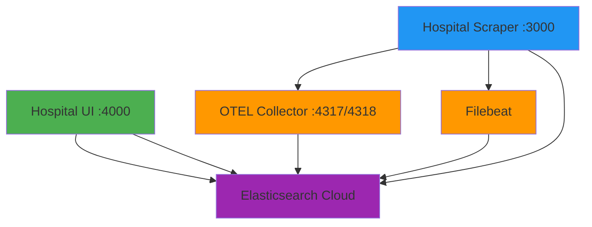

# 🗺️ Complete Port Map - TUG-Klinikum Project

## 🎯 User-Facing Services (Main Access Points)

| Port | Service | Description | Access URL | Purpose |
|------|---------|-------------|------------|---------|
| **3000** | Hospital Scraper | Scraper health endpoint | `http://localhost:3000/health` | Check scraper status |
| **4000** | Hospital UI | **Main Web Interface** | `http://localhost:4000` | **Access the dashboard & API** |

---

## 📊 Observability & Monitoring (Infrastructure)

| Port | Service | Description | Protocol | Purpose |
|------|---------|-------------|----------|---------|
| **4317** | OTEL Collector | OTLP gRPC receiver | gRPC | Receive telemetry data (traces, metrics) |
| **4318** | OTEL Collector | OTLP HTTP receiver | HTTP | Receive telemetry data (HTTP alternative) |
| **8889** | OTEL Collector | Prometheus metrics | HTTP | Prometheus-compatible metrics endpoint |

---

## 🏗️ Architecture Overview

```
┌─────────────────────────────────────────────────────────────────┐
│                        User Access Layer                         │
├─────────────────────────────────────────────────────────────────┤
│                                                                   │
│  🌐 Port 4000 - Hospital UI (Main Entry Point)                  │
│     ├── React Frontend (Dashboard)                              │
│     ├── API: /api/hospital/metrics                              │
│     └── Health: /health                                          │
│                                                                   │
│  🔧 Port 3000 - Hospital Scraper                                │
│     └── Health: /health                                          │
│                                                                   │
└─────────────────────────────────────────────────────────────────┘
                              ↓ ↓ ↓
┌─────────────────────────────────────────────────────────────────┐
│                    Observability Layer                           │
├─────────────────────────────────────────────────────────────────┤
│                                                                   │
│  📊 Port 4317 - OTEL Collector (gRPC)                           │
│     └── Receives traces & metrics from apps                     │
│                                                                   │
│  📊 Port 4318 - OTEL Collector (HTTP)                           │
│     └── Alternative HTTP endpoint                                │
│                                                                   │
│  📈 Port 8889 - Prometheus Metrics                              │
│     └── Metrics export for monitoring tools                     │
│                                                                   │
│  📝 Filebeat (no external port)                                 │
│     └── Ships logs to Elasticsearch                             │
│                                                                   │
└─────────────────────────────────────────────────────────────────┘
                              ↓ ↓ ↓
┌─────────────────────────────────────────────────────────────────┐
│                   External Services                              │
├─────────────────────────────────────────────────────────────────┤
│  ☁️  Elasticsearch Cloud (configured in .env)                   │
└─────────────────────────────────────────────────────────────────┘
```

---

## 💻 Development Mode Ports (Local Development Only)

| Port | Service | Description | When Used |
|------|---------|-------------|-----------|
| 3000 | Scraper health | Main scraper app | `npm run dev` |
| 3001 | Frontend Dev | React dev server | `npm run dev:frontend` |
| 4000 | Backend API | Express API server | `npm run dev:backend` |

---

## 🐳 Docker Compose Services

### Main Services:
1. **api-key-processor** - No port (init container)
2. **otel-collector** - Ports: 4317, 4318, 8889
3. **filebeat** - No external port
4. **hospital-scraper** - Port: 3000
5. **hospital-ui** - Port: 4000

---

## 🎯 Quick Access Guide

### For End Users:
- **Dashboard**: http://localhost:4000 (Web UI + API)
- **API Endpoint**: http://localhost:4000/api/hospital/metrics

### For Developers:
- **Scraper Health**: http://localhost:3000/health
- **UI Health**: http://localhost:4000/health
- **Prometheus Metrics**: http://localhost:8889/metrics

### For DevOps:
- **OTEL gRPC**: localhost:4317
- **OTEL HTTP**: localhost:4318
- **Logs**: Shipped to Elasticsearch (via Filebeat)
- **Traces & Metrics**: Sent to Elasticsearch APM (via OTEL)

---

## 🔐 Environment Variables (Port Configuration)

You can customize ports using these environment variables in your `.env`:

```bash
# User-facing ports
APP_PORT=3000          # Scraper health endpoint
API_PORT=4000          # UI server (main access point)

# Observability ports
OTEL_GRPC_PORT=4317    # OTLP gRPC receiver
OTEL_HTTP_PORT=4318    # OTLP HTTP receiver
METRICS_PORT=8889      # Prometheus metrics
```

---

## 🚀 Deployment Scenarios

### Production (Docker Compose):
- Only ports **3000** and **4000** are exposed to the host
- Users access: **Port 4000** for the web dashboard
- Internal services (OTEL, Filebeat) communicate via Docker network

### Development (Local):
- Port **3000**: Scraper
- Port **3001**: Frontend dev server (hot reload)
- Port **4000**: Backend API
- All ports exposed for debugging

---

## 💡 Pro Tip

**For most users, you only need to remember:**
- **Port 4000** = Your main dashboard and API
- **Port 3000** = Scraper health check (background service)

Everything else (4317, 4318, 8889) is infrastructure for monitoring and logging! 🎉

---

## 📋 Service Dependencies



---

## 🔍 Troubleshooting

### Port Already in Use
If you see errors like "port already in use":

```bash
# Check what's using a port
lsof -i :4000

# Kill process on a specific port
kill -9 $(lsof -t -i:4000)

# Or use the utility script
npm run ports:check
npm run ports:kill
```

### Cannot Access Service
1. Check if the container is running: `docker ps`
2. Check health status: `curl http://localhost:4000/health`
3. Check logs: `docker logs hospital-ui-server`

---

## 📚 Related Documentation

- [Architecture.md](./Architecture.md) - Overall system architecture
- [Observability.md](./Observability.md) - Monitoring and logging details
- [README.md](../README.md) - Project overview and setup
- [UI README](../ui/README.md) - Frontend and backend details
